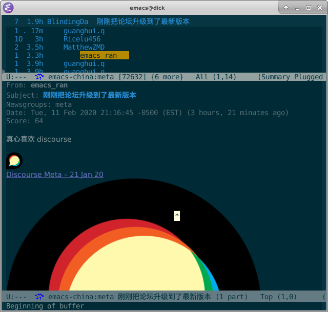

|build-status|

.. COMMENTARY (see Makefile)

.. |build-status|
   image:: https://github.com/dickmao/nndiscourse/workflows/CI/badge.svg
   :target: https://github.com/dickmao/nndiscourse/actions
   :alt: Build Status
.. |melpa-dev|
   image:: http://melpa.milkbox.net/packages/nndiscourse-badge.svg
   :target: http://melpa.milkbox.net/#/nndiscourse
   :alt: MELPA development version

.. |--| unicode:: U+2013   .. en dash
.. |---| unicode:: U+2014  .. em dash, trimming surrounding whitespace
   :trim:

Install
=======
As described in `Getting started`_, ensure melpa's whereabouts in ``init.el`` or ``.emacs``::

   (add-to-list 'package-archives '("melpa" . "https://melpa.org/packages/"))

Then

::

   M-x package-refresh-contents RET
   M-x package-install RET nndiscourse RET

You will also need Bundler_ for Ruby.

Alternatively, directly clone this repo and ``make install``.

Also see Troubleshooting_.

Usage
=====
Suppose you want to follow https://emacs-china.org.  In your ``.emacs`` or ``init.el``, use ONE of the following:

::

   ;; Applies to first-time Gnus users
   (custom-set-variables '(gnus-select-method
       (quote (nndiscourse "emacs-china.org" (nndiscourse-scheme "https")))))

or, if you're an existing Gnus user,

::

   ;; Applies to existing Gnus users
   (add-to-list 'gnus-secondary-select-methods
       (quote (nndiscourse "emacs-china.org" (nndiscourse-scheme "https"))))

Then ``M-x gnus``.

Select a topic category via ``RET``.  Rapidly catch yourself up via ``N`` and ``P``.  Instantly catch-up with ``c``.

From the ``*Group*`` buffer, press ``g`` to refresh all categories.  ``M-g`` on a particular category to refresh individually.

From the summary buffer, ``/o`` redisplays posts already read.  ``x`` undisplays them.

Gnus beginners may find the interface bewildering.  In particular, categories with no unread posts do not display.  Use ``L`` to bring them out of hiding.

Troubleshooting
===============
Clone this repo.  Then install Cask_.  Then try ``make test-run-interactive``.

.. _Cask: https://cask.readthedocs.io/en/latest/guide/installation.html
.. _Getting started: http://melpa.org/#/getting-started
.. _Bundler: https://bundler.io
